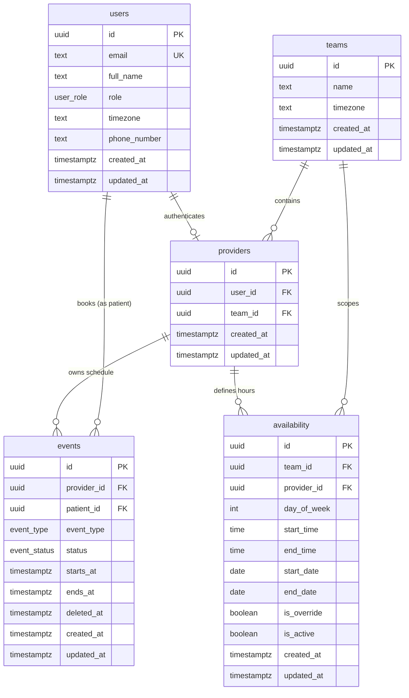
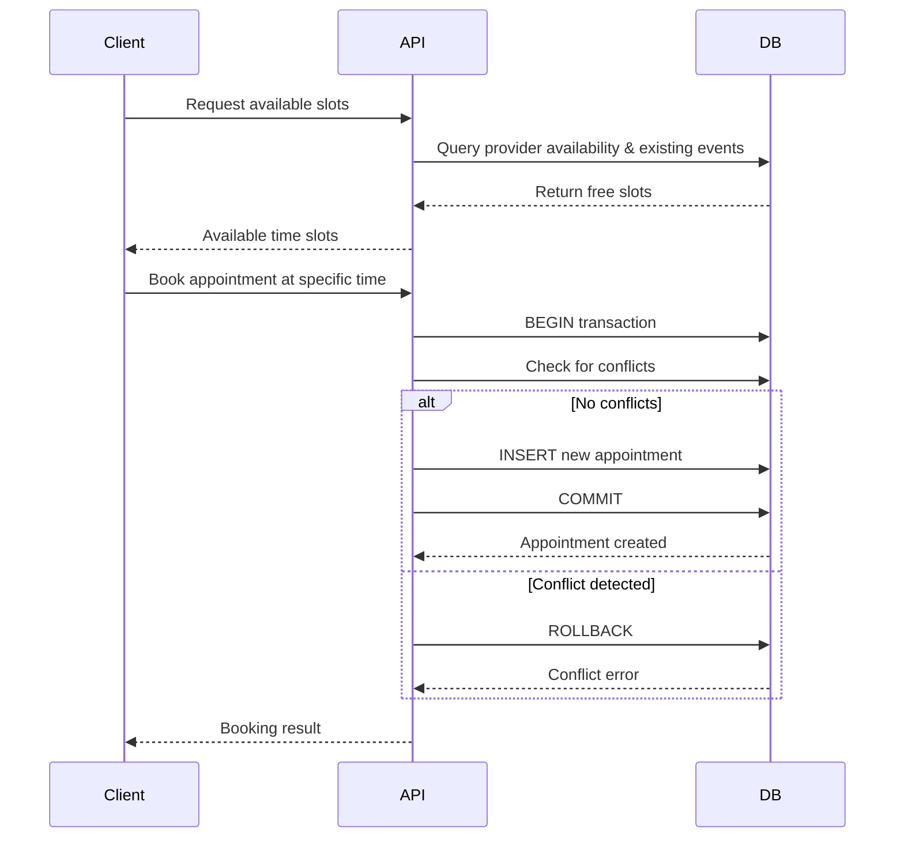

# EMR Calendar Database Documentation

## Executive Summary

This EMR calendar MVP provides essential scheduling functionality for healthcare teams, enabling providers to manage appointments with patients, define working hours, and block time for non-patient activities. The system solves core scheduling problems including conflict detection, availability management, and multi-tenancy for multiple healthcare teams. The MVP intentionally excludes advanced features like patient self-booking, notifications, resource scheduling, and complex recurring appointment patterns.

## System Overview

The database consists of five normalized tables supporting multi-tenant EMR scheduling. The core entities are:

- **Teams**: Provide tenant isolation and timezone context
- **Users**: Handle authentication for both providers and patients via role-based access
- **Providers**: Link authenticated users to teams with provider-specific data
- **Events**: Store both patient appointments and provider blocks in a unified structure
- **Availability**: Define provider working hours via recurring rules and date-specific overrides

All data is scoped by team_id for complete tenant isolation. Time is stored in TIMESTAMPTZ (UTC) with timezone conversion handled at the application layer based on team and user timezone preferences. Providers are team members who see patients; patients are users who book appointments with providers.

## ER Diagram



## Tables and Columns

### teams

**Purpose**: Multi-tenant organization units that isolate data between healthcare organizations.

- **Primary Key**: id (UUID)
- **Columns**:
  - id: UUID, unique identifier
  - name: TEXT NOT NULL, organization name
  - timezone: TEXT NOT NULL DEFAULT 'UTC', canonical timezone for team operations
  - created_at: TIMESTAMPTZ NOT NULL, audit timestamp
  - updated_at: TIMESTAMPTZ NOT NULL, audit timestamp
- **Indexes**: Primary key index only

### users

**Purpose**: Authentication and basic profile data for all system users (providers and patients).

- **Primary Key**: id (UUID)
- **Unique Constraints**: email
- **Columns**:
  - id: UUID, unique identifier
  - email: TEXT UNIQUE, login credential
  - full_name: TEXT NOT NULL, display name
  - role: user_role NOT NULL, enum('provider', 'patient')
  - timezone: TEXT NOT NULL DEFAULT 'UTC', user preference for display
  - phone_number: TEXT NULL, contact information
  - created_at: TIMESTAMPTZ NOT NULL, audit timestamp
  - updated_at: TIMESTAMPTZ NOT NULL, audit timestamp
- **Indexes**:
  - idx_users_email on (email)
  - idx_users_role on (role)

### providers

**Purpose**: Links authenticated users to teams with provider-specific scheduling data.

- **Primary Key**: id (UUID)
- **Foreign Keys**:
  - user_id → users(id)
  - team_id → teams(id)
- **Columns**:
  - id: UUID, unique identifier
  - user_id: UUID NOT NULL, authentication reference
  - team_id: UUID NOT NULL, tenant scope
  - created_at: TIMESTAMPTZ NOT NULL, audit timestamp
  - updated_at: TIMESTAMPTZ NOT NULL, audit timestamp
- **Indexes**:
  - idx_providers_team on (team_id)
  - idx_providers_user on (user_id)

### events

**Purpose**: Unified storage for patient appointments and provider blocks (vacation, training, etc.).

- **Primary Key**: id (UUID)
- **Foreign Keys**:
  - provider_id → providers(id)
  - patient_id → users(id)
- **Enums**:
  - event_type: 'appointment', 'block'
  - event_status: 'pending', 'confirmed', 'cancelled', 'completed'
- **Columns**:
  - id: UUID, unique identifier
  - provider_id: UUID NOT NULL, owner of time slot
  - patient_id: UUID NULL, required for appointments, null for blocks
  - event_type: event_type NOT NULL, discriminates appointments from blocks
  - status: event_status NOT NULL DEFAULT 'pending', business status
  - starts_at: TIMESTAMPTZ NOT NULL, event start time
  - ends_at: TIMESTAMPTZ NOT NULL, event end time
  - deleted_at: TIMESTAMPTZ NULL, soft delete marker
  - created_at: TIMESTAMPTZ NOT NULL, audit timestamp
  - updated_at: TIMESTAMPTZ NOT NULL, audit timestamp
- **Check Constraints**:
  - ends_at > starts_at
  - provider_id != patient_id (when patient_id is not null)
  - patient_id IS NOT NULL when event_type = 'appointment'
  - patient_id IS NULL when event_type = 'block'
- **Indexes**:
  - idx_events_provider on (provider_id, starts_at)
  - idx_events_patient on (patient_id, starts_at)
  - idx_events_deleted on (deleted_at)

### availability

**Purpose**: Defines provider working hours through recurring weekly schedules and date-specific overrides.

- **Primary Key**: id (UUID)
- **Foreign Keys**:
  - team_id → teams(id)
  - provider_id → providers(id)
- **Columns**:
  - id: UUID, unique identifier
  - team_id: UUID NOT NULL, tenant scope
  - provider_id: UUID NOT NULL, provider reference
  - day_of_week: INT NULL, 0-6 (Sunday=0), null for overrides
  - start_time: TIME NULL, daily start time, null for overrides
  - end_time: TIME NULL, daily end time, null for overrides
  - start_date: DATE NULL, override range start, null for recurring
  - end_date: DATE NULL, override range end, null for recurring
  - is_override: BOOLEAN NOT NULL DEFAULT false, distinguishes rule types
  - is_active: BOOLEAN NOT NULL DEFAULT true, soft disable flag
  - created_at: TIMESTAMPTZ NOT NULL, audit timestamp
  - updated_at: TIMESTAMPTZ NOT NULL, audit timestamp
- **Check Constraints**:
  - Exactly one rule type: (recurring fields all non-null and override fields all null) OR (recurring fields all null and override fields all non-null)
  - day_of_week >= 0 AND day_of_week <= 6 (when not null)
  - end_time > start_time (when not null)
  - end_date >= start_date (when not null)
- **Indexes**:
  - idx_availability_team on (team_id)
  - idx_availability_provider on (team_id, provider_id, day_of_week)
  - idx_availability_override on (team_id, provider_id, start_date, end_date)

## Data Flows (MVP Scenarios)

### Booking an Appointment



**Step-by-step process**:

1. **Query availability**: Find provider working hours for date range
```sql
SELECT day_of_week, start_time, end_time, start_date, end_date, is_override
FROM availability
WHERE provider_id = $1 AND team_id = $2 AND is_active = true;
```

2. **Check existing events**: Find conflicts with booked time
```sql
SELECT starts_at, ends_at
FROM events
WHERE provider_id = $1
  AND deleted_at IS NULL
  AND (starts_at, ends_at) OVERLAPS ($2, $3);
```

3. **Insert appointment**: Create new event with conflict check
```sql
INSERT INTO events (id, provider_id, patient_id, event_type, status, starts_at, ends_at)
VALUES ($1, $2, $3, 'appointment', 'pending', $4, $5);
```

### Setting Provider Availability

**Recurring availability** (weekly schedule):
```sql
INSERT INTO availability (id, team_id, provider_id, day_of_week, start_time, end_time, is_override)
VALUES (gen_random_uuid(), $1, $2, 1, '09:00', '17:00', false); -- Mondays 9-5
```

**Override availability** (specific dates):
```sql
INSERT INTO availability (id, team_id, provider_id, start_date, end_date, is_override)
VALUES (gen_random_uuid(), $1, $2, '2024-12-25', '2024-12-26', true); -- Christmas unavailable
```

### Blocking Time

Providers or admins block time by creating events with event_type = 'block':

```sql
-- First check for conflicting appointments
SELECT COUNT(*) FROM events
WHERE provider_id = $1
  AND event_type = 'appointment'
  AND deleted_at IS NULL
  AND (starts_at, ends_at) OVERLAPS ($2, $3);

-- If no conflicts, create block
INSERT INTO events (id, provider_id, patient_id, event_type, status, starts_at, ends_at)
VALUES (gen_random_uuid(), $1, NULL, 'block', 'confirmed', $2, $3);
```

### Conflict Detection

**Overlap detection rule**: Two time ranges overlap if `(start1, end1) OVERLAPS (start2, end2)`.

**SQL pattern for conflict checking**:
```sql
SELECT 1 FROM events
WHERE provider_id = $1
  AND deleted_at IS NULL
  AND (starts_at, ends_at) OVERLAPS ($2::timestamptz, $3::timestamptz)
LIMIT 1;
```

This query returns a row if any existing event conflicts with the proposed time range ($2, $3).

## Query Cookbook

### Find Open Slots for Provider

```sql
-- Get provider availability for specific date
WITH provider_hours AS (
  SELECT
    CASE
      WHEN is_override THEN
        CASE WHEN start_date <= $2::date AND end_date >= $2::date
             THEN NULL  -- Override makes day unavailable
             ELSE '09:00'::time  -- Default fallback
        END
      ELSE start_time
    END as available_start,
    CASE
      WHEN is_override THEN
        CASE WHEN start_date <= $2::date AND end_date >= $2::date
             THEN NULL
             ELSE '17:00'::time
        END
      ELSE end_time
    END as available_end
  FROM availability
  WHERE provider_id = $1
    AND team_id = $3
    AND is_active = true
    AND (
      (day_of_week = EXTRACT(DOW FROM $2::date) AND NOT is_override)
      OR (is_override AND start_date <= $2::date AND end_date >= $2::date)
    )
),
booked_times AS (
  SELECT starts_at::time as start_time, ends_at::time as end_time
  FROM events
  WHERE provider_id = $1
    AND DATE(starts_at) = $2::date
    AND deleted_at IS NULL
)
SELECT available_start, available_end
FROM provider_hours
WHERE available_start IS NOT NULL;
-- Additional logic needed to subtract booked_times from available hours
```

### Find Next Available Slot Across Team

```sql
WITH team_providers AS (
  SELECT p.id, p.user_id, u.full_name
  FROM providers p
  JOIN users u ON p.user_id = u.id
  WHERE p.team_id = $1
),
upcoming_slots AS (
  SELECT
    p.id as provider_id,
    p.full_name,
    generate_series(
      $2::timestamptz,
      $2::timestamptz + interval '7 days',
      interval '30 minutes'
    ) as slot_time
  FROM team_providers p
)
SELECT provider_id, full_name, slot_time
FROM upcoming_slots s
WHERE NOT EXISTS (
  SELECT 1 FROM events e
  WHERE e.provider_id = s.provider_id
    AND e.deleted_at IS NULL
    AND (e.starts_at, e.ends_at) OVERLAPS (s.slot_time, s.slot_time + interval '30 minutes')
)
ORDER BY slot_time
LIMIT 1;
```

### Race-Condition Safe Appointment Booking

```sql
BEGIN;

-- Lock provider row to prevent concurrent booking
SELECT id FROM providers WHERE id = $1 FOR UPDATE;

-- Check for conflicts
SELECT 1 FROM events
WHERE provider_id = $1
  AND deleted_at IS NULL
  AND (starts_at, ends_at) OVERLAPS ($3::timestamptz, $4::timestamptz);

-- If no conflicts found, insert appointment
INSERT INTO events (id, provider_id, patient_id, event_type, status, starts_at, ends_at)
VALUES ($2, $1, $5, 'appointment', 'pending', $3, $4);

COMMIT;
```

### Cancel or Reschedule Appointment

```sql
-- Cancel (soft delete + status change)
UPDATE events
SET status = 'cancelled', deleted_at = NOW(), updated_at = NOW()
WHERE id = $1 AND deleted_at IS NULL;

-- Reschedule (update times)
UPDATE events
SET starts_at = $2, ends_at = $3, updated_at = NOW()
WHERE id = $1 AND deleted_at IS NULL;
```

### Create Block with Conflict Verification

```sql
BEGIN;

-- Verify no overlapping appointments exist
SELECT id, starts_at, ends_at FROM events
WHERE provider_id = $1
  AND event_type = 'appointment'
  AND deleted_at IS NULL
  AND (starts_at, ends_at) OVERLAPS ($2::timestamptz, $3::timestamptz);

-- If query returns rows, block creation should fail
-- Otherwise, create the block
INSERT INTO events (id, provider_id, patient_id, event_type, status, starts_at, ends_at)
VALUES (gen_random_uuid(), $1, NULL, 'block', 'confirmed', $2, $3);

COMMIT;
```

## Time and Locale

**Storage format**: All timestamps stored as TIMESTAMPTZ in UTC. PostgreSQL automatically converts input to UTC and stores the UTC value.

**Timezone handling**:
- Teams have a default timezone (`teams.timezone`)
- Users can override with personal timezone (`users.timezone`)
- Application layer converts UTC to appropriate display timezone
- Client should send times in ISO 8601 format with timezone

**DST handling**: PostgreSQL TIMESTAMPTZ automatically handles DST transitions. No special application logic required.

**Canonical timezone**: UTC for all storage. Display conversion happens at query time:
```sql
SELECT starts_at AT TIME ZONE 'America/New_York' as local_start
FROM events WHERE id = $1;
```

**Client expectations**:
- Send: ISO 8601 with timezone (e.g., "2024-12-25T09:00:00-05:00")
- Receive: UTC ISO 8601 timestamp
- Display: Convert UTC to user/team timezone in UI

## Integrity and Performance

### Data Integrity Constraints

1. **Referential Integrity**:
   - providers.user_id → users.id
   - providers.team_id → teams.id
   - events.provider_id → providers.id
   - events.patient_id → users.id
   - availability.team_id → teams.id
   - availability.provider_id → providers.id

2. **Business Logic Constraints**:
   - events: ends_at > starts_at
   - events: provider_id != patient_id (when patient_id not null)
   - events: patient_id required for appointments, null for blocks
   - availability: exactly one rule type (recurring OR override)
   - availability: valid day_of_week range (0-6)
   - availability: end_time > start_time, end_date >= start_date

3. **Data Quality Constraints**:
   - users.email UNIQUE
   - All NOT NULL constraints on required fields

### Recommended Indexes

**Query performance indexes**:
- `idx_events_provider (provider_id, starts_at)`: Provider schedule queries
- `idx_events_patient (patient_id, starts_at)`: Patient appointment history
- `idx_availability_provider (team_id, provider_id, day_of_week)`: Recurring availability lookup
- `idx_availability_override (team_id, provider_id, start_date, end_date)`: Override availability lookup

**Operational indexes**:
- `idx_users_email (email)`: Authentication lookup
- `idx_events_deleted (deleted_at)`: Soft delete filtering
- `idx_providers_team (team_id)`: Multi-tenancy queries

### Expected Scale (MVP)

- Teams: 10-100 organizations
- Users: 1,000-10,000 total (providers + patients)
- Events: 100,000-1,000,000 appointments/year
- Availability: 1,000-10,000 rules total

**Known limits**: No hard limits in schema. Performance degrades gracefully with proper indexing.

## Security and Privacy

### PHI/PII Data Classification

**Contains PHI/PII**:
- `users`: email, full_name, phone_number
- `events`: appointment details (start/end times reveal medical visits)

**Minimal PHI**:
- `teams`: organization names
- `providers`: staff associations
- `availability`: working schedules

### Access Control Assumptions

- **Providers**: Can only access appointments within their team
- **Patients**: Can only see their own appointments
- **Team admins**: Full access to team data
- **Application layer** enforces all authorization rules

### Auditability

All tables include `created_at` and `updated_at` for change tracking. Events support soft deletion via `deleted_at` for audit trail preservation. No built-in audit log; application should log sensitive operations.

## Extension Points and V2 Ideas

**Near-term enhancements**:
- Notifications (email/SMS for appointments)
- Patient self-booking portal
- Room/resource scheduling
- Provider round-robin assignment weights
- Appointment waitlists

**Advanced features**:
- ICS calendar export
- Recurring appointment patterns
- Insurance verification workflow
- Telehealth integration
- Analytics and reporting dashboard

**Technical improvements**:
- Hard deletes with audit log table
- Optimistic locking for concurrency
- Partitioning for large event tables
- Read replicas for reporting

## Glossary

**Availability**: Time periods when a provider is available to see patients, defined by recurring weekly schedules or date-specific overrides.

**Block**: A time period when a provider is unavailable for patient appointments (vacation, training, administrative time).

**Encounter**: Not implemented in MVP; would represent the actual medical visit/consultation (future enhancement).

**Event**: Generic term for both appointments and blocks; any scheduled time on a provider's calendar.

**Override**: Date-specific availability rule that supersedes the normal weekly schedule (e.g., holiday closures, extended hours).

**Patient**: A user with role='patient' who books appointments with providers.

**Provider**: A user with role='provider' who belongs to a team and has a schedule for seeing patients.

**Slot**: A potential appointment time (derived from availability minus existing events).

**Team**: A tenant organization that groups providers and isolates data (e.g., a medical practice or clinic).

**Tenant**: Same as team; organizational unit for data isolation in multi-tenant system.

hello
